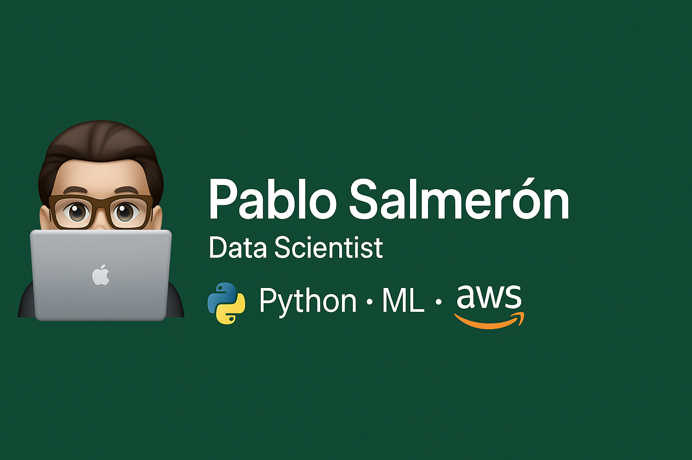

  
    
    
    
    
    

### About Me
- 💻 Data Engineer
- 🚀 Tech Enthusiast
- 🌐 Open-source Lover

### Skills and Technologies
- **Languages**: JavaScript, Python, SQL
- **Cloud**: AWS
- **Web Technologies**: HTML, CSS
- **Databases**: MySQL, PostgreSQL

### Featured Projects
- **[Data Analysis with Python](https://github.com/pablosalme/analisis_datos_python)**: Practical exercises and projects from my Data Analysis and AI course.
- **[Apache Spark Course](https://github.com/pablosalme/pyspark_course)**: Code and datasets used in my Udemy course on Apache Spark.

### Connect with Me

  
  
  

   

Feel free to explore my repositories and connect with me!

